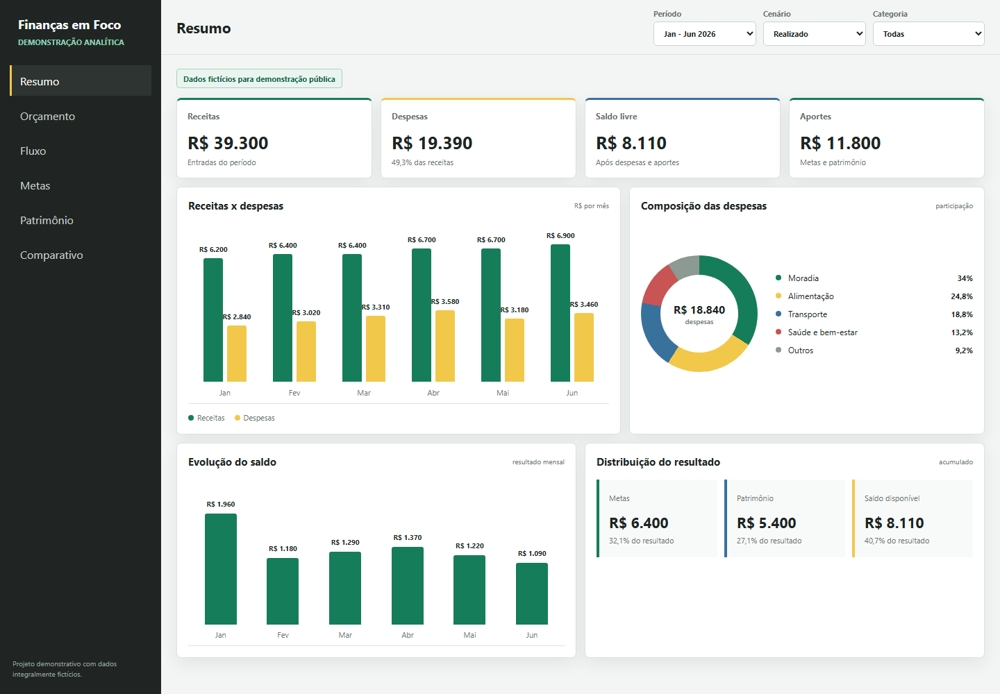
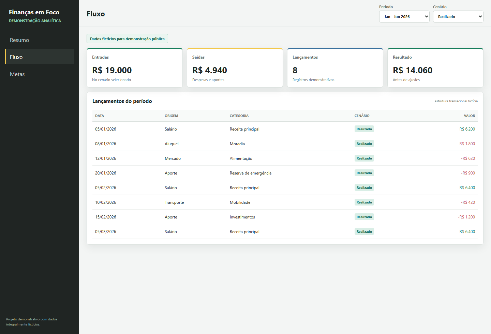
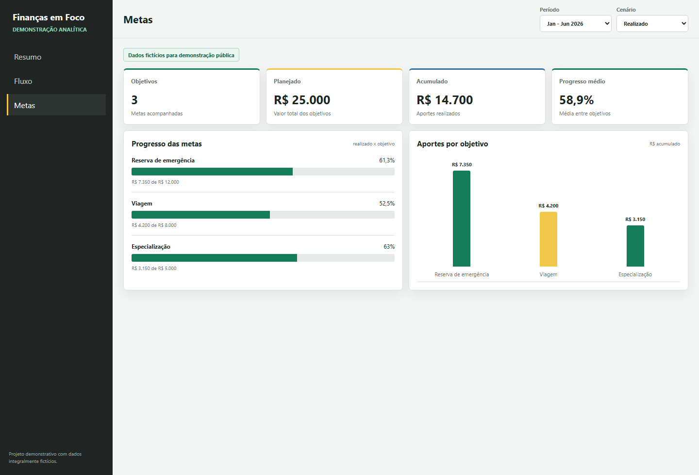
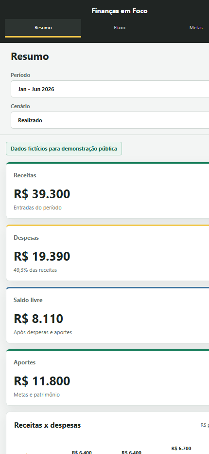

# Dashboard Financeiro em Power BI

**Case de Business Intelligence para análise de receitas, despesas, metas, patrimônio e comparação entre valores previstos e realizados.**

O projeto combina modelagem, DAX, storytelling e governança para organizar informações financeiras em uma experiência analítica clara e segura.

> A publicação utiliza somente dados fictícios. Arquivos pessoais, bases reais, PBIX e planilhas originais não fazem parte do repositório.

## Demonstração

[Abrir demonstração interativa](https://nnathanvieira.github.io/dashboard-financeiro-power-bi/demo/dashboard_demo.html)

A experiência permite navegar entre resumo, fluxo e metas, alterar período e cenário e observar a atualização dos indicadores. Os valores e lançamentos são totalmente fictícios.

| Resumo financeiro | Fluxo de lançamentos |
| --- | --- |
|  |  |

Metas e visualização responsiva

## Problema de negócio

Informações financeiras dispersas dificultam entender o resultado do período, identificar categorias que pressionam o orçamento e acompanhar metas. O case organiza esses dados para responder:

- o mês fechou positivo ou negativo?
- quais categorias concentram as despesas?
- qual é a diferença entre previsto e realizado?
- quanto está sendo direcionado para metas e patrimônio?
- como os indicadores evoluem por mês, ano, pessoa e categoria?

## Solução

O dashboard foi estruturado como um produto analítico, combinando:

- base transacional fictícia;
- regras de classificação financeira;
- modelo de dados para Power BI;
- medidas DAX;
- comparação entre expectativa e realidade;
- camada visual customizada com HTML, CSS e JavaScript;
- documentação técnica e cuidados de privacidade.

## Competências demonstradas

- Power BI e modelagem de dados;
- Power Query e preparação de bases;
- DAX e indicadores financeiros;
- visualização e storytelling analítico;
- HTML, CSS e JavaScript no HTML Content;
- documentação de regras de negócio;
- anonimização e publicação segura.

## Arquitetura

## Conteúdo

- [análise técnica](docs/analise_tecnica.md);
- [modelo de dados](docs/modelo_de_dados.md);
- [guia de demonstração segura](docs/demo_powerbi.md);
- [dados fictícios](dados_exemplo).

## Tecnologias

`Power BI` · `Power Query` · `DAX` · `Excel` · `HTML` · `CSS` · `JavaScript` · `Modelagem de dados`

## Privacidade

Como o domínio envolve finanças pessoais, o repositório publica somente código, documentação e dados simulados. Nenhum valor, conta, instituição ou hábito financeiro real é exposto.
